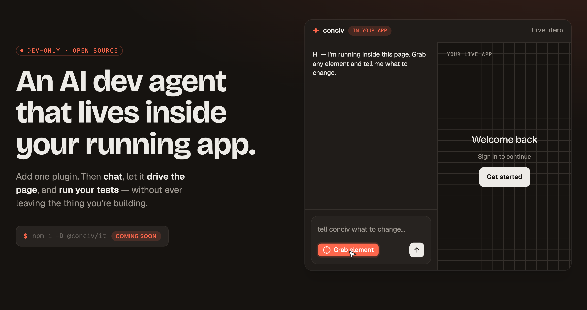
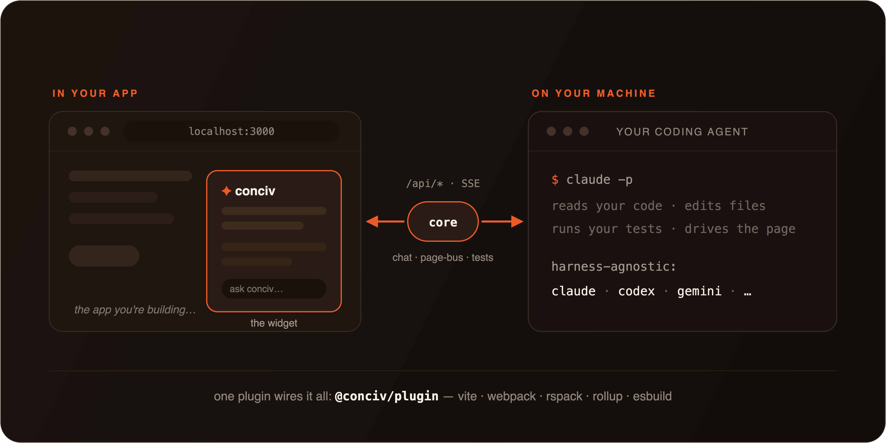

<div align="center">

<a href="https://conciv.dev">
  
</a>

<h1>✦&nbsp; conciv</h1>

<p>
  <em>Conceive it.</em>
  <br>
  <strong>An AI dev agent that lives inside your running app.</strong>
  <br>
  Add one plugin. Then chat, let it drive the page, and run your tests,
  <br>
  without ever leaving the thing you're building.
</p>

<p>
  <a href="https://conciv.dev"><strong>Website</strong></a>
  &nbsp;·&nbsp;
  <a href="./apps/examples/tanstack-start"><strong>Example app</strong></a>
  &nbsp;·&nbsp;
  <a href="./apps/site/content/docs"><strong>Docs</strong></a>
  &nbsp;·&nbsp;
  <a href="https://github.com/conciv-dev/conciv/issues"><strong>Report a bug</strong></a>
</p>

<p>
  <a href="https://www.npmjs.com/package/@conciv/it"></a>
  
  
  
  
</p>

</div>

---

## What is conciv?

**conciv** puts an AI dev agent inside the app you are already running. Add one build plugin,
and a conciv button appears in your dev preview. Open it and you're talking to an agent that can
**see the page you're building**, **drive it**, **edit your source**, and **run your tests**, all
in the same window, without a second terminal or a context switch.

It's **dev-only** (never shipped to production) and **harness-agnostic**: it drives a real coding
CLI under the hood (Claude Code today, Codex and others behind one interface), so the agent is as
capable as the tool you already trust.

## Features

- 💬 &nbsp;**Chat in-app**: talk to an agent that sees your running page, streams its reasoning, and calls tools live.
- 🕹️ &nbsp;**Page control**: it grabs elements, clicks, fills, inspects React props/state, and live-edits the DOM to preview changes.
- 🧪 &nbsp;**Live tests**: run Vitest and watch pass/fail result cards render right inside the app.
- 🧩 &nbsp;**Extensions**: drop a `.tsx` file in `conciv/extensions/` and get a new agent tool with its own card and composer UI.
- 🎨 &nbsp;**Shared whiteboard**: an Excalidraw canvas you and the AI draw on together, with source-anchored comments.
- ✅ &nbsp;**Approvals**: risky or networked commands surface an Approve / Deny card before they run.
- 🔌 &nbsp;**One plugin**: Vite, webpack, Rspack, Rollup, or esbuild. Dev-only, never in your production bundle.
- 🤝 &nbsp;**Harness-agnostic**: Claude Code today; Codex and others behind a single capability interface.
- 🌘 &nbsp;**Zero style leak**: the widget lives in an open Shadow DOM, isolated from your app's CSS.

## How it works

<div align="center">
  
</div>

`@conciv/plugin` boots a framework-free **hono** engine (`@conciv/core`) behind a set of `/api/*`
routes on its own dev port, spawns a headless harness (default `claude -p`), and injects a Solid
widget into your previewed page. The widget probes `/api/chat/session` on load and only shows the
conciv button when the dev routes are live, so it stays inert on a plain preview.

## Try it live

No install needed: open [conciv.dev](https://conciv.dev), click "Try it live", and paste the
pairing prompt into Claude Code (or run the `npx @conciv/try` command it shows). The widget on
the landing page connects to the agent on your machine. Everything stays local: the core binds
`127.0.0.1` only, gated by a one-time token, and prompts never touch our servers.

## Quickstart

```sh
npm i -D @conciv/it
```

Add the plugin to your app's `vite.config.ts`:

```ts
import {defineConfig} from 'vite'
import conciv from '@conciv/it/plugin/vite'

export default defineConfig({
  plugins: [conciv()],
})
```

Make sure the [Claude Code CLI](https://claude.ai/code) (`claude`) is on your `PATH`, start your
dev server, and click the conciv button in the corner of your app.

Override defaults via `conciv({harness, testRunner, widgetUrl, …})`. Other bundlers are one import
away: `@conciv/it/plugin/webpack`, `/rspack`, `/rollup`, `/esbuild`, `/nextjs`.

## Extensions

Teach the agent new tricks with a single file. Drop a `.tsx` into `conciv/extensions/` and it's
discovered automatically. One `defineTool` gives the agent a callable tool (`.server` runs in
node), a rendered result card, and optional widget UI (`.render` + `useSlot`), all typed
end-to-end with zod:

```tsx
import {z} from 'zod'
import {defineExtension, defineTool} from '@conciv/extension'

const deployRun = defineTool({
  name: 'deploy_run',
  description: 'Deploy the current branch',
  inputSchema: z.object({env: z.enum(['staging', 'prod'])}),
})
  .server(({env}) => ({url: `https://${env}.example.com`}))
  .render((props) => <DeployCard {...props} />)

export default defineExtension({name: 'deploy', tools: [deployRun]})
```

Extensions are plain Solid JSX (compiled as a Solid zone even inside a React host app) and ship
with a real test harness: [`@conciv/extension-testkit`](./packages/extension-testkit) mounts any
extension in a real browser against a real spawned server.

Two built-ins show what the contract can do:

- 🎨 &nbsp;[**Whiteboard**](./packages/extensions/whiteboard): a shared Excalidraw canvas over your dev app. You sketch, the AI draws back (real editable elements, mermaid included), with source-anchored comments and pins on a self-hosted libSQL store (TanStack DB).
- 🧪 &nbsp;[**Test runner**](./packages/extensions/test-runner): runner-agnostic test execution (Vitest and Playwright) with live result cards in the thread.

## Supported tools

| Area          | Full support                     | In progress                      |
| ------------- | -------------------------------- | -------------------------------- |
| **Harnesses** | Claude Code (`claude -p`), Codex | Gemini CLI, opencode, Pi         |
| **Bundlers**  | Vite                             | webpack, Rspack, Rollup, esbuild |
| **Tests**     | Vitest, Playwright               | Jest, `node:test`                |

## Packages

Install these. Everything else on npm under `@conciv/*` is internal and comes in automatically:

| Package                                                     | What it is                                                                                                 |
| ----------------------------------------------------------- | ---------------------------------------------------------------------------------------------------------- |
| [`@conciv/it`](./packages/it)                               | **The one you install.** Thin umbrella: `@conciv/it/plugin/vite` (+ webpack/rspack/rollup/esbuild/nextjs). |
| [`@conciv/extension`](./packages/extension)                 | The extension authoring contract: `defineExtension`/`defineTool` + typed `useSlot`/`useContext` hooks.     |
| [`@conciv/extension-testkit`](./packages/extension-testkit) | Mounts any extension in a real browser against a real spawned server, through its real contract.           |
| [`@conciv/try`](./packages/try)                             | `npx @conciv/try --token <t>`: try conciv live on conciv.dev with the agent already on your machine.       |

Under the hood (installed automatically by `@conciv/it`):

| Package                                                              | What it is                                                                                                               |
| -------------------------------------------------------------------- | ------------------------------------------------------------------------------------------------------------------------ |
| [`@conciv/protocol`](./packages/protocol)                            | Shared wire types + `define*` factories (chat, generative UI, test, page, harness). Zero-runtime.                        |
| [`@conciv/core`](./packages/core)                                    | The framework-free hono engine: every `/api/*` route, session, uiBus, harness + test registries.                         |
| [`@conciv/harness`](./packages/harness)                              | Harness adapters behind a capability interface: Claude + Codex, plus Gemini/opencode/Pi stubs.                           |
| [`@conciv/plugin`](./packages/plugin)                                | The dev agent as an unplugin: `vite` (full) + webpack/rspack/rollup/esbuild. Boots core + injects the widget.            |
| [`@conciv/embed`](./packages/embed)                                  | The browser half: mounts the conciv Solid app into an open Shadow DOM, with the chat UI, cards, and page-control driver. |
| [`@conciv/cli`](./packages/cli)                                      | The `conciv` CLI the agent calls from Bash: `tools server / page / test / open` + `ui`.                                  |
| [`@conciv/extension-whiteboard`](./packages/extensions/whiteboard)   | Built-in: the shared Excalidraw canvas with AI drawing and source-anchored comments.                                     |
| [`@conciv/extension-test-runner`](./packages/extensions/test-runner) | Built-in: runner-agnostic test execution with live result cards.                                                         |

## Documentation

Full docs live at **[conciv.dev](https://conciv.dev)** and in
[`apps/site/content/docs`](./apps/site/content/docs): quick-start guides per bundler, usage
(chat, page control, live tests, approvals), harness and test-runner configuration, and
troubleshooting.

## Contributing

Issues and PRs are welcome. This is a young project moving fast, so the best first step is to run the
[example app](./apps/examples/tanstack-start), find something rough, and open an issue.

```sh
pnpm install
pnpm dev        # runs the tanstack-start example with conciv wired in
```

## Star history

<a href="https://www.star-history.com/#conciv-dev/conciv&Date">
  <picture>
    <source media="(prefers-color-scheme: dark)" srcset="https://api.star-history.com/svg?repos=conciv-dev/conciv&type=Date&theme=dark">
    <source media="(prefers-color-scheme: light)" srcset="https://api.star-history.com/svg?repos=conciv-dev/conciv&type=Date">
    
  </picture>
</a>

## License

[MIT](./LICENSE) © conciv

<div align="center">
  <br>
  <sub><strong>conciv</strong> · as in <code>@conciv/it</code>. Say it out loud.</sub>
  <br>
  <sub>Built with hono, Solid, and a real coding agent living in the page.</sub>
</div>
