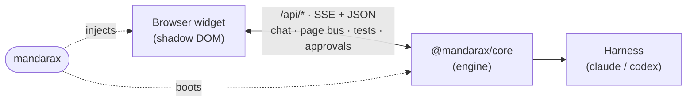

mandarax has three parts. The build plugin boots an engine and injects the widget. The widget runs in
your page. The engine talks to a headless agent.

## The parts

<Cards>
  <Card title="Plugin" description="mandarax boots the engine and injects the widget script into your dev build." />
  <Card
    title="Widget"
    description="A chat UI in an open shadow DOM. It probes the engine and shows the ✦ button when dev routes are live."
  />
  <Card title="Engine" description="@mandarax/core serves the chat, page, and test APIs on its own dev port." />
  <Card title="Harness" description="The headless agent process behind the chat, such as Claude Code." />
</Cards>

## A turn

<Steps>
  <Step>You ask something in the chat. The agent reads the live page to ground itself.</Step>
  <Step>It acts: edits files, drives the DOM, or runs your tests. Output streams back into the widget.</Step>
  <Step>Anything risky pauses for your approval before it runs.</Step>
</Steps>

Next: [Quick start](/docs/quick-start) to add it, or [Usage](/docs/usage) to see each capability.
