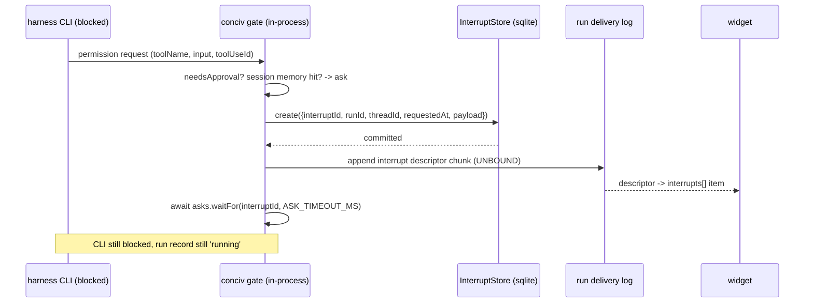
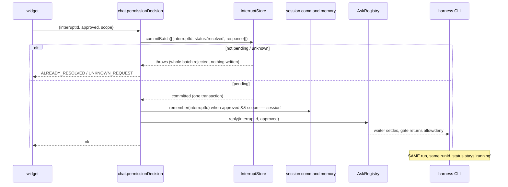
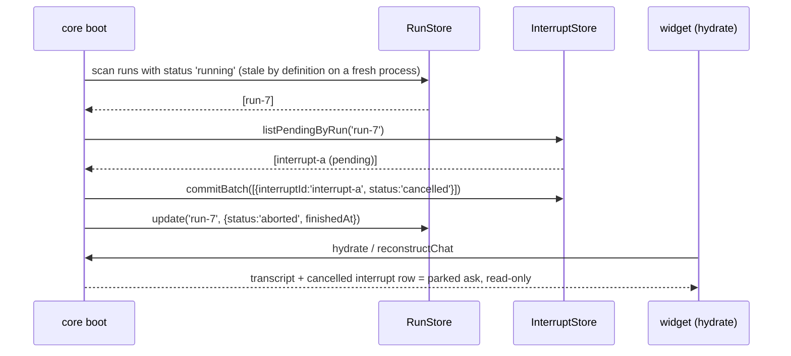

# Gate-to-Interrupt Adapter (Calm Chat Plane 2.b)

Design for workstream 2.b of [the Calm Chat Plane spec](./2026-08-26-calm-chat-plane.md). No product
code changes here.

Citations marked `ai:` are against the local TanStack/ai clone at `6881d986` (2026-08-27), where
`packages/ai` is `0.51.0`, `ai-client` `0.29.1`, `ai-persistence` `0.5.3`, `ai-claude-code` `0.6.2`.
The branch catalog pins `@tanstack/ai 0.48.0` (`pnpm-workspace.yaml:28-40`). Every `ai:` citation must
be re-verified against the `@tanstack/ai@0.48.0` tag before implementation — see decision 8.

## 1. The impedance mismatch

Ours: the approval is a **promise inside a live process**. `makeAskGate` mints an `approvalId`, opens
a waiter, emits an `approval-requested` CUSTOM chunk, and awaits the waiter while the harness CLI
subprocess sits blocked on its permission bridge (`packages/core/src/chat/gate.ts:147-160`):

```ts
const approvalId = randomUUID()
deps.asks.open(approvalId)
deps.onAsk?.(approvalId)
deps.emit(aguiApprovalRequestedFor({toolCallId: toolUseId, toolName, input: toolInput, approvalId}))
const approved = await deps.asks.waitFor(approvalId, deps.timeoutMs ?? ASK_TIMEOUT_MS)
```

The waiter lives in an in-memory `Map` (`packages/core/src/chat/ask.ts:40-102`). The emitted chunk is
appended to the run's delivery log, which is `memoryStream` — process-lifetime only
(`packages/core/src/chat/runtime.ts:65-66`, `run.ts:377,383`). Resolution arrives over oRPC
`chat.permissionDecision` (`packages/contract/src/contract.ts:131-134`,
`packages/core/src/api/rpc/chat.ts:22-30`) and settles the waiter; the CLI turn never stopped.

Theirs: an interrupt **ends the run**. When a `needsApproval` tool has no resolution yet, the engine
pushes it onto `needsApproval` (`ai: packages/ai/src/activities/chat/tools/tool-calls.ts:957-1013`),
`emitActionableInterruptBoundary` builds a synthetic `RUN_FINISHED` with
`outcome: {type: 'interrupt', ...}` (`ai: packages/ai/src/activities/chat/index.ts:2057-2078,
2724-2740`), the tool phase is set to `'wait'` and the run generator returns
(`ai: activities/chat/index.ts:737, 2890-2913`). `ai: docs/interrupts/boundaries.md:41-43`: "That
batch ends the current run with one `interrupt` outcome."

Resumption is a **new `chat()` call** carrying `parentRunId` + `resume`
(`ai: activities/chat/index.ts:494-504, 3966-4054`; `ai: docs/interrupts/apply-answers.md:27-43`).
On the client, the staged batch is submitted through `submitInterruptBatch` →
`resumeInterruptsUnsafeForGeneration` → `streamResponse()` with `resume` on the run context
(`ai: packages/ai-client/src/chat-client.ts:1393-1437, 1350-1383, 2349, 2367`) — **the same `send`
that streams the continuation, not a separate resolve endpoint.**

**There is no standalone resolve transport.** That is unusable for us: our run is a CLI subprocess
mid-turn holding an open permission bridge; ending the run kills the turn, and a continuation run
cannot re-enter it.

Upstream's own CLI harness confirms the limit rather than solving it. `ai-claude-code` wires Claude's
`--permission-prompt-tool` (`ai: packages/ai-claude-code/src/adapters/text.ts:287-288, 300-359`) and,
on an unresolved `ask`, emits the legacy `approval-requested` custom event and **denies**
(`ai: text.ts:339-353`):

```ts
if (outcome.needsApproval) {
  sink.push(buildApprovalRequestedEvent({...}))
  return {behavior: 'deny', message: 'Awaiting client approval. Approve in the UI and re-run to continue.'}
}
```

> **Correction to the dispatch brief.** There is no explicit "approval-gated tools are not supported"
> fail-fast in `ai-claude-code`. What exists is worse and more informative: `needsApproval` on a
> chat()-registered tool is simply **never consulted** on this path — the sandbox tool bridge calls
> `tool.execute` unconditionally (`ai: packages/ai-sandbox/src/tool-bridge.ts:155-182`). The adapter's
> own approval story is "deny and tell the human to re-run". Our blocking gate exists precisely
> because "re-run to continue" is not an acceptable product behaviour, and nothing upstream replaces
> it.

## 2. What stays ours, and why

| Piece                                         | Verdict | Why                                                                                               |
| --------------------------------------------- | ------- | ------------------------------------------------------------------------------------------------- |
| The in-memory waiter (`AskRegistry`)          | ours    | It is what unblocks the live CLI. Nothing upstream settles a promise inside a still-running run.  |
| The resolution transport (oRPC)               | ours    | Their resolve path IS a continuation run (`ai: chat-client.ts:1393-1437`). We must not start one. |
| "Allow for session" memory                    | ours    | Their only middleware seat runs too late — proven in §7.                                          |
| CLI JSONL transcript anchor/boundary merge    | ours    | Their adapters treat the native session as opaque.                                                |
| `InterruptRecord` rows + `InterruptStore` API | adopted | Persistence, restart recovery, atomic batch semantics.                                            |
| The interrupt descriptor + `interrupts` shape | adopted | One pending-decision surface in the widget, replacing two bespoke ones.                           |

## 3. Ask creation

Ordering rule: **the interrupt row is written and committed BEFORE the descriptor is emitted, and the
descriptor is emitted before the waiter is awaited.** A viewer must never see an ask that has no row
(it would vanish on restart with no recovery path), and the waiter must never be awaited before the
ask is observable (an un-answerable block).



`interruptId` replaces today's `approvalId`, stays a v4 UUID minted in the gate, and is the
idempotency key for everything downstream (§6).

Row shape, filling their `InterruptRecord` (`ai: packages/ai-persistence/src/types.ts:237-293`;
column layout `ai: packages/ai-persistence/skills/ai-persistence/build-drizzle-adapter/SKILL.md:92-102`):

```ts
{
  interruptId,                        // our approvalId
  runId,                              // the LIVE conciv run, still status 'running'
  threadId: sessionId,
  status: 'pending',                  // create() forces this; insert-if-absent
  requestedAt: Date.now(),
  payload: {
    kind: 'tool-approval',
    definitionId: 'conciv:tool-approval',
    toolCallId: toolUseId,
    toolName,
    input: toolInput,
    rememberableCommand: string | null,   // drives the "allow for session" button
  },
}
```

`create` "is a **no-op** if an interrupt with the same `interruptId` already exists … so a duplicate
create can never clobber a resolved interrupt back to pending"
(`ai: packages/ai-persistence/src/types.ts:245-250`).

Transaction boundary: `create` is one awaited statement. It is deliberately NOT in the same
transaction as any run-record write — the run record is already `'running'` and stays that way (§4).

Response schema (what the widget sends back), our decision type, a superset of today's
`PermissionDecisionSchema` (`packages/protocol/src/chat-types.ts:131-135`):

```ts
const ConcivApprovalResponseSchema = z.object({
  approved: z.boolean(),
  scope: z.enum(['once', 'session']).default('once'),
})
```

Client-side shape: the descriptor is emitted **unbound** — no `INTERRUPT_BINDING_METADATA_KEY`
metadata. Per `ai: docs/interrupts/overview.md:86-88`, an interrupt with a missing binding has
`kind: 'unbound'`, "remains visible, but has no controls", and the library "will not invent a binding
to make these resolvable". That is exactly the property we need: their client surfaces the pending
decision in `interrupts` and can never start a continuation run for it
(`ai: packages/ai-client/src/types.ts:239-247`). Our controls stay `ToolViewCtx.respondApproval`
(`packages/protocol/src/tool-view-types.ts:39`,
`packages/ui-kit-chat/src/tools/primitives/permission.tsx:28-39`).

## 4. Resolution

Our RPC, not their resolve path. `chat.permissionDecision` keeps its identity and gains the store
write. Ordering is **commit first, settle second**.



`commitBatch` is the atomicity and the duplicate guard in one: it must "reject the whole batch
(throw, writing nothing) when any entry has a duplicate `interruptId`, references an `interruptId`
that does not exist, or references an interrupt whose status is not `'pending'`"
(`ai: packages/ai-persistence/src/types.ts:264-276`). The bare `resolve`/`cancel` fallback has **no**
such guard — the reference Drizzle `resolve` is an unguarded `UPDATE ... WHERE interruptId = ?`, so a
second resolve silently overwrites (`ai: SKILL.md:366-375`). **Our store must implement `commitBatch`
and the RPC must route through it exclusively.** Calling `resolve()` directly is a review-reject.

Suppressing their continuation semantics rests on three mechanical facts, not on convention:

1. We never return `{interrupts}` from `onInterruptBoundary` and no tool of ours sets
   `needsApproval`, so the engine never reaches `emitActionableInterruptBoundary` and never ends the
   run (`ai: activities/chat/index.ts:2057-2078`).
2. The descriptor is unbound, so their client has no `resolveInterrupt` closure to build and cannot
   stage or submit a batch (`ai: packages/ai-client/src/interrupt-manager.ts:1007-1063, 1174-1206`).
3. Our `chat.send` input has no `resume`/`parentRunId` field (`packages/contract/src/contract.ts:120-129`)
   and gains none in 2.b. A stray `resume` fails zod validation rather than silently forking a run.

`RunRecord` fields kept coherent
(`ai: packages/ai/src/activities/chat/middleware/run-store.ts:106-162`):

- `status` stays `'running'` for the whole pause. We deliberately do NOT use `'interrupted'`. It is
  "written ONLY by `withPersistence`'s `onInterrupt`" (`ai: run-store.ts:20-30`) — a hook we never
  reach — and `findActiveRun` returns only `'running'` runs, which is what lets a hydrating client
  tail a live run (`ai: run-store.ts:255`, `ai: docs/persistence/store-reference.md:113-117`).
- `finishedAt`, `error`, `usage` untouched until the real run end.
- `cancelRequested` remains the 'stopping' source. A stop during a pending ask sets it, and
  `asks.cancel(sessionId)` settles every waiter to `null` → `timeout` decision
  (`packages/core/src/chat/ask.ts:95-102`, `packages/core/src/chat/stop.ts:12`). Those rows are
  `cancelled` in the same batch, not `resolved` — cancel is payloadless, denial is a resolved no
  (`ai: docs/interrupts/migration.md:77-81`).
- `sandboxKey`, `detachedSince`, `driverEpoch` stay unwritten in 2.b; they belong to 2.c's
  run-driver seam.

## 5. Restart behavior — parked asks

A pending interrupt whose process died is unresolvable by construction: the waiter was in memory
(`packages/core/src/chat/ask.ts:41`) and the CLI subprocess is gone.

`listReclaimable` cannot find these rows' runs on its own: it requires **all three** of
`status === 'running'`, `detachedSince` set, and `detachedSince <= now - ttlMs`
(`ai: run-store.ts:222-240`), and nothing sets `detachedSince` for us until 2.c wires
`withSandbox`. So the boot sweep is: for a single-process core, every run record still marked
`'running'` at boot is stale by definition; take its `listPendingByRun` rows
(`ai: packages/ai-persistence/src/types.ts:292`) and cancel them.

**Parked is derived, not a new column**: `status === 'cancelled'` with `response` absent, on a run
that never reached `'completed'`. No flag is added beside an existing status (anti-sediment).



Rendering: a parked ask renders as a **settled, read-only** permission surface with a
"not answered — the session restarted" note. Same component; the difference is `ctx.respondApproval`
being absent, which `permission.tsx:28-33` already treats as not-pending. Nothing new is invented.

**If the user answers a parked ask: drop it with a notice.** Chosen over re-ask-on-next-run because
(a) the tool call it gated belongs to a dead CLI turn — approving it cannot make that call happen,
and re-issuing it out of turn runs a side effect the model no longer expects; (b) our
`ASK_TIMEOUT_MS` path already models "no decision" as a refusal the model reads (`gate.ts:93-97`),
so "an unanswered ask is a refused tool call" is the established mental model; (c) the honest
recovery is the user re-prompting, and the transcript makes that obvious. Mechanically the answer
cannot even be sent — the parked surface has no controls — so this is the default rather than an
enforced rule.

**Cross-workstream hazard (feeds 2.c).** Their server-authoritative hydrate refuses to tail when any
interrupt is pending: `hydrateFromServer` applies `result.interrupts.pending` and returns **before**
checking `activeRun`, commenting "Pending interrupt = the thread is paused awaiting a human decision,
so there is nothing to tail … the interrupt always wins"
(`ai: packages/ai-client/src/chat-client.ts:1029-1078`, esp. 1056-1073). For us a pending ask is a
run that IS still streaming. Therefore our hydrate endpoint must report
`interrupts: null` for live runs and let the delivery-log tail carry the ask; the InterruptStore is
server-side persistence plus parked rendering, not the client's pending-interrupt source. See
decision 5.

## 6. Duplicate and racing decisions

Idempotency key: `interruptId` — minted once in the gate, primary key of the store, key of the oRPC
input.

- **Two tabs answer at once.** Node is single-threaded and the handler awaits `commitBatch` before
  anything else, so the calls serialize; the second gets a thrown batch (not-pending), is mapped to
  `ALREADY_RESOLVED`, and never reaches `asks.reply`. Today there is no such guard: `asks.reply`
  returns `false` on the second call only because the first already deleted the map entry
  (`ask.ts:70-76, 84`) — an accident of cleanup order, not a contract.
- **Replay after reconnect.** Replay re-delivers the descriptor from the delivery log. The widget's
  `interrupts` projection is keyed by `interruptId` and a resolved row projects as settled, so a
  re-delivered descriptor for an answered id renders settled, never actionable.
- **Timeout racing a decision.** The waiter's timer settles to `null`; `commitBatch` decides the
  winner. A decision landing after the timeout is rejected as not-pending, so the model's refusal and
  the store row agree.
- **Retried ask for the same `toolUseId`.** `create` is insert-if-absent
  (`ai: ai-persistence/src/types.ts:245-250`), so a retry cannot resurrect a settled row.

New contract error beside today's `UNKNOWN_REQUEST`:

```ts
.errors({
  UNKNOWN_REQUEST: {message: 'no pending approval'},
  ALREADY_RESOLVED: {status: 409, message: 'that approval was already answered'},
})
```

## 7. Middleware ordering — and why "allow for session" cannot sit in `onBeforeToolCall`

The spec's candidate seat is **refuted by the engine source**. In `executeToolCalls`, the approval
gate is evaluated FIRST and `onBeforeToolCall` runs only after an approval has already resolved as
approved (`ai: packages/ai/src/activities/chat/tools/tool-calls.ts:957-1040`):

```ts
if (tool.needsApproval) {
  const resolution = approvalResolution(approvals, toolCall.id)
  if (resolution !== undefined) {
    if (approved) {
      input = editedApprovalArgs(resolution) ?? input
      if (middlewareHooks) {
        const decision = await applyBeforeToolCallDecision(...)   // onBeforeToolCall HERE
        if (!decision.proceed) continue
      }
      yield* executeServerTool(...)
    } else { /* declined -> output-error */ }
  } else {
    needsApproval.push({toolCallId: toolCall.id, toolName, input, approvalId})  // pause, no hook
  }
  continue
}
if (middlewareHooks) { const decision = await applyBeforeToolCallDecision(...) }  // non-approval tools
yield* executeServerTool(...)
```

Order, unambiguous: **(a) approval gate → (b) `onBeforeToolCall`
(`ai: tool-calls.ts:541-558, 970-980, 1018-1028`) → (c) `executeServerTool`.** When approval is
unresolved the hook is never called at all. A session-memory short-circuit at `onBeforeToolCall`
would therefore fire _after_ the user was already asked — it cannot skip an ask.

There is also **no sandbox-policy check anywhere in `packages/ai/src`**. Sandbox policy is a separate
mechanism (`ai: packages/ai-sandbox/src/policy.ts`, `approvals.ts:56-74`) applied by harness adapters
through the permission bridge, which is exactly where our gate is mounted
(`packages/core/src/chat/gate.ts:208-237`). Our gate and their `onBeforeToolCall` are on two
different planes and never race.

**Decision: "allow for session" stays exactly where it is** — inside `needsApproval` in our gate
(`packages/core/src/chat/gate.ts:79-85`), consulted _before_ an ask is minted, keyed by normalized
command in `CommandMemory` (`packages/core/src/chat/command-memory.ts:13-45`). It is safe there for
the reason it always was: it is checked on the ask-creation path, it stores only
`rememberableCommand`-normalized strings, and it is per-session in-memory state that dies with the
session. `onBeforeToolCall` gets no conciv seat in 2.b.

## 8. `conciv_ui` as a `defineInterrupt`

Today `conciv_ui` is a tool whose `execute` blocks on a bespoke side channel: `noteToolCall` pushes an
unclaimed UI call (`packages/core/src/chat/ask.ts:103-131`), `askUi` claims the next one and waits
(`ask.ts:140-146`), the widget answers over `chat.uiReply` (`packages/contract/src/contract.ts:135-138`,
`packages/core/src/api/rpc/chat.ts:31-36`). Two mechanisms — a claim queue and an answer channel —
exist only because a tool result must come from a human.

Replacement: one `defineInterrupt` definition, `conciv:ui-question`
(`ai: packages/ai/src/interrupt-definition.ts:418-473`; the definition carries `id`, `payloadSchema`,
`responseSchema` — `ai: interrupt-definition.ts:44-52, 202-219`):

```ts
id: 'conciv:ui-question'
payloadSchema: UiInputSchema // kind, question, detail, options, fields, multiSelect, allowOther
responseSchema: UiAnswerValueSchema // string | string[] | Record<string, string>
```

Both already exist at `packages/protocol/src/ui-types.ts:45-59`, so nothing is invented. The tool's
`execute` becomes: create the row, emit the unbound descriptor, await the waiter keyed by
`interruptId`, return `{answered: true, value}` or the existing `UNANSWERED` note. It uses the SAME
adapter as approvals — one creation path, one resolution path, one parked path. That shared path is
why 2.b is one workstream.

Files that die (the bespoke channel only):

- `packages/core/src/chat/ask.ts` — `UiCall`, `uiCalls`, `uiWaiters`, `noteToolCall`, `nextUiCall`,
  `askUi`, `UNANSWERED` (lines 13-19, 103-146). The generic waiter (`open`/`reply`/`waitFor`/`cancel`)
  stays.
- `packages/core/src/chat/ask-constants.ts` — `TOOL_CALL_WAIT_MS`, `UI_TOOL_NAME`.
- `packages/core/src/chat/run.ts:245-249` — `noteToolCall` chunk sniffing.
- `packages/core/src/api/mcp.ts:254` — the `NoteToolCall` wiring into the code-mode surface.
- `packages/core/src/runtime/core-runtime.ts:113-114, 160-162` — `noteToolCall`, `nextUiCall`, `ui`.
- `packages/core/src/app.ts:394-396` — `makeToolCtx`'s `askUi`; `ConcivToolContext` in
  `packages/tools/src/types.ts` and its use in `packages/tools/src/server.ts:7-10`.
- `packages/contract/src/contract.ts:135-138` — `chat.uiReply`; the oRPC surface diff for 2.b shows
  exactly this one removal.
- `packages/core/src/api/rpc/chat.ts:31-36` — the `uiReply` handler.
- `apps/conciv/src/pane/use-pane-messaging.ts:41, 50-52, 97` and `apps/conciv/src/pane/chat-pane.tsx:173`
  — the `uiReply` mutation and `addResult` wiring.
- `packages/protocol/src/tool-view-types.ts:37, 48` — `addResult` on ctx and card props, plus
  `INERT_ADD_RESULT` (`packages/ui-kit-chat/src/store/tool-context.tsx:4`) and the prop threading in
  `packages/ui-kit-chat/src/primitives/message/message.tsx:150` and
  `packages/ui-kit-chat/src/tools/styled/tool-call-card.tsx:27, 68`.
- `packages/core/test/api/mcp/ui-ask.it.test.ts`; the `uiReply` cases in
  `packages/core/test/rpc/wire.it.test.ts:482-513`.

Survives: `packages/tools/src/ui.ts` (reshaped from `toolDefinition` to `defineInterrupt`),
`packages/tools/src/cards/ui-card.tsx` (renderer, driven by an `interrupts` item instead of a
`ToolCallPart`/`ToolResultPart` pair), `UiInputSchema`, `UiAnswerValueSchema`.

## 9. Test plan

New:

1. `packages/core/test/chat/interrupt-restart-parked.it.test.ts` — pending approval + core restart:
   row created, process killed mid-ask, fresh core over the same DB boots, row is `cancelled`, run is
   terminal, hydration yields a read-only parked ask.
2. `packages/core/test/chat/interrupt-late-join-restart.it.test.ts` — late-join after restart: a
   subscriber attaching to the restarted core sees the parked ask exactly once, with no live controls.
3. `packages/core/test/chat/interrupt-duplicate-decision.it.test.ts` — two decisions on one
   `interruptId`: first returns ok and settles the waiter, second throws `ALREADY_RESOLVED`, CLI
   receives exactly one decision.
4. `packages/core/test/chat/interrupt-row-before-emit.it.test.ts` — creation ordering: with the emit
   gated, the store already holds a `pending` row before any subscriber can observe the descriptor.
5. `packages/core/test/chat/ui-interrupt.it.test.ts` — `conciv_ui` over the interrupt path: question →
   pending row → decision → tool result carries the answer, in the same run.
6. `packages/core/test/chat/session-memory-no-second-ask.it.test.ts` — the §7 claim as executable
   evidence: after `scope: 'session'`, the identical command creates NO second interrupt row.
7. `apps/conciv/test/parked-ask.browser.test.tsx` — parked vs live rendering: live has
   approve/deny/allow-for-session; parked renders settled with the restart note and no controls.

Must pass UNMODIFIED (weakening any is stop-the-line, spec §2.c):

- `packages/core/test/chat/snapshot-resubscribe.it.test.ts`
- `packages/core/test/chat/parked-run-resubscribe.it.test.ts`
- `packages/core/test/chat/code-mode-approval-replay.it.test.ts`
- `packages/core/test/chat/mcp-approval.it.test.ts` (all five cases, incl. the session-scope one at
  line 90)
- `packages/core/test/chat/permission-gate.test.ts` (incl. the session-memory block, lines 83-138)
- `packages/core/test/chat/mcp-ask-path.it.test.ts`
- `packages/core/test/chat/ask-registry.test.ts`, `packages/core/test/chat/command-memory.test.ts`
- `packages/core/test/chat/approving-call-post-result-traffic.it.test.ts`
- `packages/core/test/chat/run-record-restart.it.test.ts`
- `packages/ui-kit-chat/test/permission-card-session.browser.test.tsx`,
  `trace-permission-block.browser.test.tsx`, `chain-approval-collapse.browser.test.tsx`

One sanctioned edit: `packages/embed/tests/e2e/embed.it.test.ts:177` names `uiReply` and must be
reshaped with the `conciv_ui` change; the reshaped test still drives the card in a real browser.

harness-testkit fixture needs (it already has `holdTools`/`holdResults`/`releaseResults`
`packages/harness-testkit/src/scripted-run.ts:12-16, 158-160`, `approvalIds`
`packages/harness-testkit/src/run-events.ts:52-55`, `withAutoApproval`
`packages/harness-testkit/src/call-tool.ts:95-116`):

- `approvalIds` must learn the new descriptor chunk shape and nothing else; it is the one place tests
  parse the wire shape, so it is the seam to change.
- A `killCore()` / `rebootCore()` pair (kill without draining, reboot over the same DB path). Tests 1
  and 2 cannot be written without it and no existing helper does it.
- Expose the pending `interruptId` from the testkit so a run parked on an ASK (not on a tool result)
  is observable without sleeping — `scriptToolCall(..., {blocking: true})` + `holdResults` only parks
  on results today.

## 10. Risks

- **Version drift.** Every `ai:` citation is from `0.51.0`; the branch pins `0.48.0`. `commitBatch`,
  `listPendingByRun`, and the unbound-interrupt client behaviour are the young surfaces most likely to
  differ. This is the largest correctness risk in the design.
- **There is no shipped Drizzle `InterruptStore`.** `packages/ai-persistence/src` contains contracts
  plus an in-memory reference store; the Drizzle table definitions live in a _skill document_
  (`ai: skills/ai-persistence/build-drizzle-adapter/SKILL.md:92-102`). 2.a must write the adapter
  against `defineInterruptStore`, and it must implement `commitBatch` (the reference `resolve` is
  unguarded last-write-wins, `ai: SKILL.md:366-375`).
- **Unbound is a state built for OTHER producers.** We would use it for our own interrupts on purpose.
  If upstream ever filters unbound items out of `interrupts`, our client surface disappears. Cheap
  mitigation: one browser test asserting an unbound descriptor reaches the `interrupts` array.
- **Their hydrate refuses to tail when an interrupt is pending** (§5, `ai: chat-client.ts:1056-1073`).
  If 2.c adopts `hydrate()` naively, a live run with a pending ask stops streaming for a reloading
  widget. This must be a named acceptance criterion in 2.c, not a discovery.
- **Two sources of pending truth during the pause.** A `commitBatch` can succeed and `asks.reply` then
  find no waiter (run already torn down). The RPC must report that as resolved-but-unheard, not
  swallow it.
- **The gate now does IO before blocking.** One sqlite insert on a path that was pure in-memory; re-read
  the first-chunk deadline math (`packages/core/src/chat/run-timing.ts`) before implementing.

## 11. Decisions for Omri

1. **Emit approvals as UNBOUND interrupt descriptors and keep oRPC as the resolution transport, or
   adopt their bound `resolveInterrupt` + continuation run?**
   _Recommendation: unbound + oRPC._ Their resolve path is fused into a new `chat()` send
   (`ai: chat-client.ts:1393-1437, 2349-2367`) and cannot re-enter a live CLI turn.
2. **Run status during a pause: keep `'running'`, or use their `'interrupted'`?**
   _Recommendation: `'running'`._ `'interrupted'` is written only by `withPersistence`'s `onInterrupt`
   (`ai: run-store.ts:20-30`), which we never reach, and only `'running'` runs are returned by
   `findActiveRun`.
3. **Parked ask answered by the user: drop with a notice, or re-ask on the next run?**
   _Recommendation: drop with a notice_ (§5). Re-issuing a dead turn's tool call runs a side effect the
   model is no longer expecting.
4. **Boot sweep: `cancel()` parked rows, or leave them `pending` forever?**
   _Recommendation: `cancel()` via `commitBatch`._ Leaving them pending makes `listPending` unbounded
   and makes "is anything waiting on me" unanswerable.
5. **Does our hydrate endpoint ever report pending interrupts to their client?**
   _Recommendation: no — report `interrupts: null` for live runs_ (§5 hazard). Otherwise a reloading
   widget stops tailing a run that is still streaming.
6. **Seat for "allow for session": `onBeforeToolCall`, or keep it in our gate?**
   _Recommendation: keep it in our gate._ The engine calls `onBeforeToolCall` only AFTER an approval
   resolved (`ai: tool-calls.ts:957-1040`), so it cannot suppress an ask. The spec's candidate seat is
   refuted; §7 is the evidence and test 6 is the executable proof.
7. **`ALREADY_RESOLVED` as a new oRPC error, or fold into `UNKNOWN_REQUEST`?**
   _Recommendation: new error._ A second tab must be told "someone already answered", not "that ask
   does not exist".
8. **Re-verify against `@tanstack/ai@0.48.0` before implementing, or move Phase 1's pin to 0.51?**
   _Recommendation: re-verify at 0.48 first_ (`git diff '@tanstack/ai@0.48.0'..HEAD -- packages/ai/src
packages/ai-persistence/src packages/ai-client/src` on the clone) and treat a pin bump as its own
   Phase 1 decision rather than smuggling it into 2.b.
9. **`conciv_ui` in the same PR as approvals, or a follow-up?**
   _Recommendation: same PR._ They share creation, resolution, and parked paths; splitting means
   building the adapter twice.
